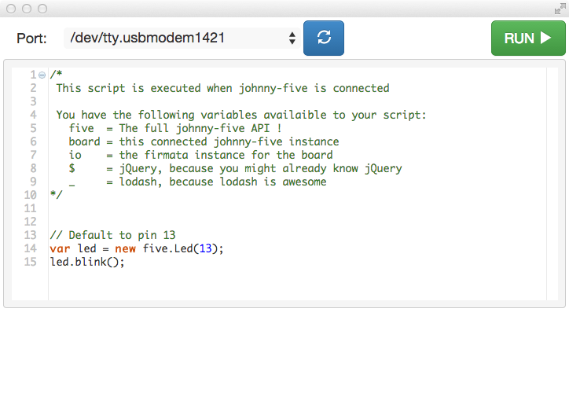

Johnny-Five Chrome
=======

This app lets you run [Johnny-Five](https://github.com/rwaldron/johnny-five) directly in Chrome.

Screenshot:



## Pre-packaged version
Just want to use it? You can [install a pre-packaged version from Chrome Web Store](https://chrome.google.com/webstore/detail/johnny-five-chrome/gjnfhdmcgnaiogffpdoiecllabiabdee)


## Build it yourself

```
npm install
gulp
````
And load up the build directory as a chrome extenstion.

